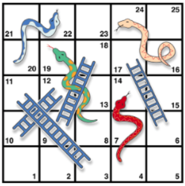

In the chutes and ladders game, a pawn is moved from the starting position of 1 to a finishing position of 25. A virtual dice is rolled to determine the number of positions that the pawn can move forward. If the pawn encounters the bottom of a ladder, the pawn climbs to the top of the ladder. If the pawn encounters the top of a chute, it slides down to the bottom of the chute. The positioning of the chutes and ladders on the board are shown in the picture below.

In the bounce back version of chutes and ladders, if the pawn overshoots past position 25, it bounces back to a lower position. For instance, if a pawn is at position 23 and the dice rolls a 6, the pawn moves forward 2 positions to position 25 and then bounces back 4 positions to 21.

It was determined that the average number of dice rolls for 1000 simulations is 17.




```{r}
# set up a coordinate system to identify the location of the pawn (numbers 1 to 25)
coordinate = matrix(c(1:5, 10:6, 11:15, 20:16, 21:25),
                    nrow = 5, ncol = 5, byrow = T)
# position is a matrix variable that consists of either 0 or 1; a 1 indicates the present position of the pawn
position = matrix(c(0), nrow = 5, ncol = 5, byrow = T)
dice = c() #runif(1, 0, 7)
numberOfSimulations = 1000
xValues = c()


# Enter Coordinate Values (1:25)
ladderTop = c(11,17,18,12)
ladderBottom = c(3,6,9,10)
chuteTop = c(14,19,24,22)
chuteBottom = c(4,8,16,20)

bounceBack = function(lastDiceRoll, initialPosition) {
  finalPosition = 50 - lastDiceRoll - initialPosition
  return(finalPosition) }


for(i in 1:numberOfSimulations) {
  dice = c()
  position = matrix(c(0), nrow = 5, ncol = 5, byrow = T)
  position[1] = 1
  
  while(position[which(coordinate == 25)] == 0) {
    # while the pawn is not at the last position
    
    # roll the dice
    dice = append(dice, round(runif(1, 0, 7)))
    while(dice[length(dice)] == 7 || dice[length(dice)] == 0) {dice[length(dice)] = round(runif(1, 0, 7))}
    
    # determine where the pawn is and where it should end up
    presentCoordinatePosition = coordinate[which(position == 1)]
    futureCoordinatePosition = presentCoordinatePosition + dice[length(dice)]
    # if the pawn moves past the 25th position, bounce back
    if(futureCoordinatePosition > 25) {futureCoordinatePosition = bounceBack(dice[length(dice)], presentCoordinatePosition) }
    
    # if the pawn lands on top of a chute (snake head), slide down to the bottom
    if(length(which(chuteTop == futureCoordinatePosition)) == 1) {futureCoordinatePosition = chuteBottom[which(chuteTop == futureCoordinatePosition)] }
    # if the pawn lands on the bottom of a ladder, climb to the top
    if(length(which(ladderBottom == futureCoordinatePosition)) == 1) {futureCoordinatePosition = ladderTop[which(ladderBottom == futureCoordinatePosition)] }
    
    position = matrix(c(0), nrow = 5, ncol = 5, byrow = T)
    position[which(coordinate == futureCoordinatePosition)] = 1 }
  
  xValues = append(xValues, length(dice)) 
  }

barplot(table(xValues)/numberOfSimulations, xlab = "Number of Dice Rolls", ylab = "Frequency", ylim = c(0,max(table(xValues)/numberOfSimulations)), main = "Frequency of Dice Rolls")
print(paste("The average number of dice rolls for", numberOfSimulations, "simulations is", round(mean(xValues)), "."))


```
